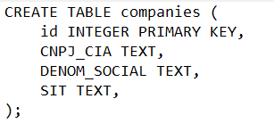

# Projeto Case Técnico SPARTA

## Indice

- <a href="#-objetivos"> Objetivos </a>

- <a href="#-tecnologias-utilizadas"> Tecnologias Utilizadas </a>

- <a href="#-linha-de-codigo">Linha de Código </a>

- <a href="#-etapas-do-projeto"> Etapas do Projeto </a>

- <a href="#-demonstracao"> Demonstração </a>

- <a href="#-considerações-finais"> Considerações Finais </a>

## Objetivo

       Projeto foi desenvolvido para importar os dados de um arquivo com formatação .csv em Python e armazená-los em um banco de dados em SQL apenas as seguintes informações: CNPJ, NOME DA EMPRESA e SIT.

      Desenvolver um sistema para realizar a consulta de um CNPJ específico e apresentar os dados registrados no banco de dados. 

## Tecnologias Utilizadas

[Python] (https://www.python.org)

[SQLSERVER] (https://www.microsoft.com/en-us/sql-server/sql-server-downloads)

[VSCODE] (https://code.visualstudio.com)

## Linha de Código

Código de criação de tabela

Código de importação de dados em Python

Código para consulta de códigos em Python

## Etapas do Projeto
- <a href="#-criação-do-banco-de-dados"> Criação do banco de dados </a>

Criação do banco de dados nomeado como "companies".

- <a href="#-criação-de-tabela"> Criação de Tabela </a>

Criação da tabela para integrar os dados: CNPJ, NOME DA EMPRESA e SIT e considerar cada valor como texto.
- <a href="#-importação-de-dados"> Importação de Dados </a>

Código para importação dos dados do arquivo em .csv e armazenamento dos dados importados no banco de dados "companies".

- <a href="#-execução-do-banco-de-dados"> Execução do banco de dados </a>

Execução do Banco de dados com os dados importados na etapa anterior informando o CNPJ, NOME DA EMPRESA E SIT.

- <a href="#-consulta-dos-dados"> Consulta dos dados </a>

Execução do código para realizar a consulta do CNPJ e retornando a informação de NOME DA EMPRESA e SIT.
Caso consultar um CNPJ que não esteja no banco de dados irá mandar uma mensagem "Empresa não encontrada".

## Demonstração
[Criação de tabela](sqlite3.sql)

[Importação de dados](companies.py)

[Consulta de dados](consulte.py)

## Considerações Finais

Esse projeto teve como desafio criar um banco de dados em SQL e importar os dados de um arquivo utilizando linguagem em Python. Além de realizar uma consulta dos dados de um CNPJ específico para apresentação de todas as informações importadas para o banco de dados.
Para aprimoração do projeto, criar uma interface para criar essa consulta do banco de dados, assim ficar mais intuitivo a qualquer usuário realizar a consulta.